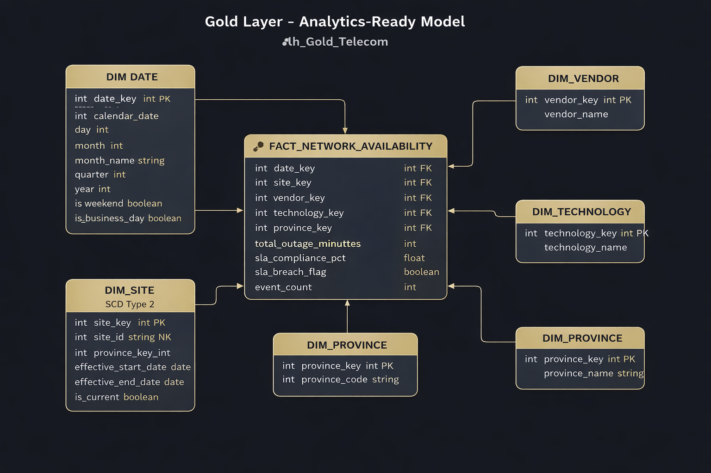

# 📡Telecom-Network-Availability-Engineering-Analysis-Project

## 📘 Project Overview
This project implements an **end-to-end data engineering solution** for analysing **telecom network availability and outage events** using **Microsoft Fabric**.  

The platform is designed using a **Lakehouse-first Medallion Architecture (Bronze–Silver–Gold)** and focuses on **engineering best practices** such as incremental ingestion, SLA compliance logic, data quality observability, and scalable orchestration.

---

## 🎯 Business Problem
Telecom operators must continuously monitor:
- Network downtime
- SLA compliance (e.g., 99.9% availability)
- Root causes of outages
- Regional and technology-based reliability

This platform simulates a **realistic telecom operational environment** and provides a scalable foundation for:
- Network reliability analysis
- SLA breach detection
- Operational performance reporting

---

## 🧱 Architecture Overview
Source CSV Files
→ Fabric Pipelines (Copy Activity)
→ lh_Bronze_Telecom (Raw, Immutable Data)
→ Bronze Validation Notebook (Schema & Ingestion Checks)
→ lh_Silver_Telecom (Cleansed Data + SLA Logic)
→ lh_Gold_Telecom (Analytics-Ready Star Schema)
→ Power BI (Direct Lake)

### Key Design Choices
- **Lakehouse architecture** 
- **Direct Lake** for BI consumption
- **PySpark notebooks** for all transformations
- **Fabric Pipelines** for ingestion & orchestration
- **Schema-on-read** in Bronze

---

## 🧪 Data Description

### Source Data
Generated **South Africa–themed telecom outage data**, provided as monthly CSV files:

## 🥉 Bronze Layer – Raw Ingestion

### Lakehouse
**`lh_Bronze_Telecom`**

### Responsibilities
- Raw data ingestion only
- No transformations
- Schema drift allowed
- Metadata captured for auditing

### Ingestion Method
- **Fabric Pipeline (Copy Activity)**
- Parameterized by year and month
- Files written to OneLake partitions: Files/network_events/year=YYYY/month=MM/

### Metadata Captured
- `ingestion_timestamp`
- `source_file_name`
- `ingestion_run_id`

---

## 🥈 Silver Layer – Cleansing & SLA Logic

### Lakehouse
**`lh_Silver_Telecom`**

### Responsibilities
- Data cleansing & normalization
- SLA calculations (99.9% target)
- Late-arriving data handling (watermark-based)
- Data quality validation & observability

### Key Tables
- `silver_network_events`
- `silver_sites`
- `silver_vendors`
- `silver_technologies`
- `silver_provinces`
- `silver_data_quality_metrics`

### Core Engineering Features
- Recalculation of outage duration (do not trust source)
- SLA breach detection
- Business hour & peak-hour enrichment
- Data quality metrics per batch run

---

## 🥇 Gold Layer – Analytics-Ready Model

### Lakehouse
**`lh_Gold_Telecom`**

### Star Schema
**Fact**
- `fact_network_availability`

**Dimensions**
- `dim_date`
- `dim_site` (SCD Type 2 – preserves historical site attributes)
- `dim_vendor`
- `dim_technology`
- `dim_province`

### Purpose
- Stable, analytics-ready data
- Optimized for Power BI consumption
- No business logic changes at this layer

---

## 📊 Analytics & Reporting

### BI Tool
- **Power BI (Direct Lake mode)**

### Dashboard Focus
- Network availability trends
- Outage duration by month
- Outage duration by cause
- Outages by province
- SLA compliance overview

> Customer impact and cost metrics are intentionally excluded due to lack of authoritative source data.

---

## 🔄 Orchestration Strategy

### Pipelines
- `pl_Bronze_NetworkEvents_Ingest`
- `pl_Telecom_EndToEnd` (parent orchestration)
- `pl_Gold_Processing`

### Execution Principles
- Bronze → Silver → Gold dependencies
- Idempotent month-level ingestion
- Restartable pipeline design
- Audit-friendly metadata logging

---

## 📌 Project Phases

| Phase | Status |
|-----|------|
| Phase 0 – Architecture & Decisions | ✅ Complete |
| Phase 1 – Environment Setup | ✅ Complete |
| Phase 2 – Bronze Ingestion |  ✅ Complete  |
| Phase 3 – Silver Transformations | ✅ Complete |
| Phase 4 – Gold Modeling |✅ Complete |
| Phase 5 – BI Dashboard | 🔄 In progress |
| Phase 6 – Enhancements  | ⏳ Future |

---

